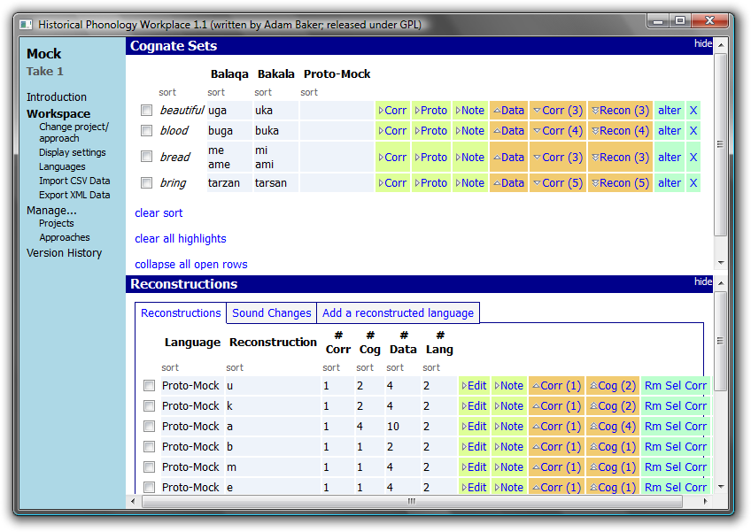

Introduction
------------

Historical Phonology Workplace is software for doing historical phonological analysis.

*   Doesn't force structure on your analysis, beyond what the logic of the comparative method requires.
*   Keeps track of all your analytical decisions.
*   Stores associations between levels of analysis.
*   CSV data import.
*   XML export so that data and/or analysis can be repurposed.



Documentation
-------------

The interface for Historical Phonology Workplace is web-like, so the intuitions you have from navigating around web sites should carry over. There is reasonably complete documentation in the program itself (left menu, under “Introduction”), which is also available [here](/hpw_intro).

The initial configuration of Historical Phonology Workplace includes nonsense data and an analysis. If you accidentally delete that example and want it back, you can just copy this [database.db](applications/database.db) into the same directory of the executable. (Be careful not to overwrite your own analyses in so doing!) The nonsense data are also available: [mock.csv](applications/mock.csv).

Downloads
---------

Historical Phonology Workplace is created with the [Qt application framework](https://www.qt.io/), released under the GNU Public License. That means, among other things, that you are free to download it and use it, but not to re-sell it.

Qt is a cross-platform framework, so there is the possibility for using this on Mac OS X, Linux, etc.
I build in Windows with this, which assumes that Qt is installed and visible in your path:

```
qmake -config release
mingw32-make
```

Of course your system would have something different from “mingw32-make”—probably just “make”—if you are not building from Windows using MinGW.
